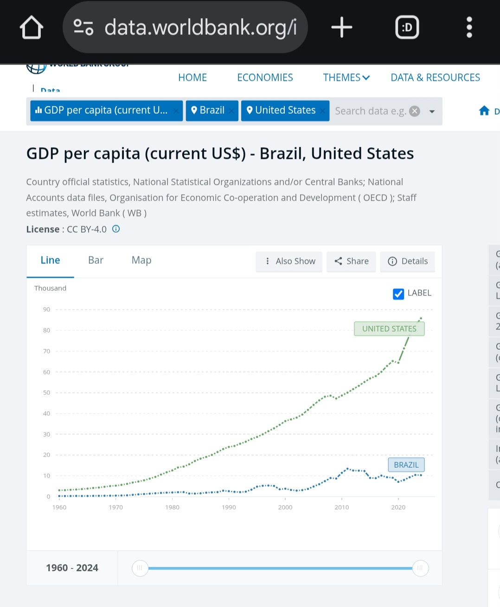

# MHGA
Make Human Grouth Again

# MAGA: Análise Crítica de uma Narrativa Populista no Capitalismo Contemporâneo

![bovo]20251026_152151.jpeg)

## Resumo Executivo

Este paper examina a dissonância entre a retórica do movimento "Make America Great Again" (MAGA) e os dados econômicos objetivos, argumentando que o movimento representa uma estratégia populista que mascara contradições estruturais do capitalismo contemporâneo através da construção de bodes expiatórios.

## 1. Introdução: O Paradoxo do Crescimento sem Prosperidade

O movimento MAGA emergiu em 2016 prometendo restaurar a grandeza econômica americana, alegando que o país estava em declínio. Contudo, dados do Banco Mundial revelam uma trajetória oposta: o PIB per capita dos Estados Unidos alcançou $85.809,90 em 2024, representando crescimento contínuo e sustentado ao longo de décadas.

Este paradoxo levanta questões fundamentais: se a economia cresce, por que o discurso de declínio ressoa? A resposta está na distinção entre crescimento agregado e distribuição de riqueza.

## 2. A Estratégia do Bode Expiatório: Imigração como Narrativa

### 2.1 A Construção da Ameaça Migratória

O movimento MAGA posicionou a imigração como causa central dos problemas econômicos americanos, alegando que imigrantes:
- "Roubam" empregos de americanos
- Reduzem salários
- Sobrecarregam serviços públicos
- Ameaçam a identidade nacional

### 2.2 Contradições Empíricas

**Dados econômicos refutam essa narrativa:**

- O PIB per capita cresceu consistentemente durante períodos de alta imigração
- Estudos do National Bureau of Economic Research demonstram que imigrantes contribuem positivamente para inovação e empreendedorismo
- 45% das empresas Fortune 500 foram fundadas por imigrantes ou filhos de imigrantes
- Imigrantes preenchem lacunas críticas no mercado de trabalho (agricultura, tecnologia, saúde)

**Impacto fiscal:**
- Imigrantes contribuem mais em impostos do que consomem em serviços públicos no longo prazo
- Rejuvenescem a força de trabalho em sociedades envelhecidas
- Aumentam a demanda agregada, criando empregos

## 3. As Verdadeiras Causas da Ansiedade Econômica

### 3.1 Desigualdade Crescente

Enquanto o PIB per capita cresce, a distribuição torna-se cada vez mais concentrada:

- Os 1% mais ricos dos EUA detêm aproximadamente 32% da riqueza nacional (2024)
- Os 50% mais pobres detêm apenas 2% da riqueza
- Salários reais da classe média estagnaram desde os anos 1970, apesar do crescimento da produtividade

### 3.2 Desindustrialização e Automação

**Perda de empregos manufatureiros:**
- Não foi causada primariamente por imigração ou acordos comerciais
- Automação eliminou milhões de postos de trabalho
- Decisões corporativas de deslocalização priorizaram lucros sobre comunidades locais

### 3.3 Financeirização da Economia

- Crescimento do setor financeiro captura porcentagem desproporcional dos lucros
- Investimentos de curto prazo prejudicam planejamento industrial de longo prazo
- Recompra de ações beneficia acionistas em detrimento de salários e investimento produtivo

## 4. MAGA como Estratégia Populista Reacionária

### 4.1 Características do Populismo MAGA

**Elementos retóricos:**
- Nostalgia de uma "era dourada" (anos 1950-60)
- Construção do "povo puro" vs. "elites corruptas"
- Nacionalismo econômico simplista
- Promessas de soluções rápidas e radicais

> Não é dor, é design.
Uma engenharia política e econômica de concentração de renda disfarçada de revolta popular.

---

**O MAGA**  como mecanismo de reconcentração de renda

Toda vez que o capitalismo entra em crise de distribuição — quando o lucro se distancia da renda — surge uma narrativa moral ou nacionalista para relegitimar o acúmulo.

Época	Contexto Econômico	Narrativa Política	Resultado

1870–1910 (Era Dourada)	Concentração após Revolução Industrial	“Destino Manifesto” e imperialismo	Expansão externa e monopólios (Rockefeller, Carnegie)

1920s	Boom pós-Primeira Guerra	“América para os americanos”	Crise de 1929
1980s (Reaganomics)	Estagnação e inflação	“Livre mercado e fé”	Explosão da desigualdade e do capital financeiro

2015–2025 (MAGA)	Estagnação salarial e digitalização total	“Voltar a ser grande”	Captura fiscal e midiática pelos super-ricos

O padrão é sempre o mesmo:

> Quando o topo precisa garantir seus privilégios, ele cria um inimigo emocional e simplifica a culpa.

O MAGA, nesse sentido, é o quarto ciclo de re-concentração do capitalismo americano moderno.

---

Massa imigrante “top top” — o paradoxo histórico

Historicamente, os imigrantes são a base da expansão americana — irlandeses, italianos, judeus, chineses, latinos.
Eles renovam a força produtiva e criativa.

Mas hoje há um paradoxo:

A elite globalizada depende da mão de obra e inovação imigrante (Silicon Valley é 70% estrangeira).

Enquanto isso, o populismo nativista usa esses mesmos imigrantes como bode expiatório para proteger o privilégio interno.

Ou seja:

> A América precisa dos imigrantes para continuar crescendo,
mas o MAGA precisa odiá-los para continuar existindo.

**Contradições práticas:**
- Gabinete composto por bilionários e executivos de Wall Street
- Cortes de impostos beneficiaram principalmente corporações e ultra-ricos
- Desregulamentação favoreceu grandes empresas sobre trabalhadores
- Protecionismo seletivo prejudicou setores que alegava proteger

### 4.2 A Função Ideológica da "Farsa"

O termo "farsa" se justifica não pela sinceridade dos apoiadores, mas pela funcionalidade do discurso:

1. **Desvio de atenção:** Problemas estruturais do capitalismo são atribuídos a "externos" (imigrantes, China, etc.)

2. **Preservação do sistema:** Críticas se dirigem a bodes expiatórios, não a desigualdade sistêmica ou poder corporativo

3. **Mobilização sem transformação:** Energia popular é canalizada para mudanças simbólicas, não estruturais

4. **Contradição classe-retórica:** Políticas de classe dominante vendidas como defesa do "trabalhador comum"

## 5. Comparação Internacional: O Fenômeno Global

O MAGA não é isolado. Movimentos similares emergiram globalmente:

- Brexit (Reino Unido)
- Frente Nacional (França)
- Lega Nord (Itália)
- AfD (Alemanha)
- Bolsonarismo (Brasil)

**Padrão comum:**
- Países com crescimento econômico mas desigualdade crescente
- Culpabilização de imigrantes, minorias ou "globalistas"
- Promessas nostálgicas de restauração nacional
- Implementação de políticas neoliberais sob retórica nacionalista

## 6. Anatomia de uma Contradição

O movimento MAGA representa um caso paradigmático de populismo reacionário no capitalismo tardio. Sua caracterização como "farsa" se sustenta na análise da contradição entre:

**Retórica:**
- Defesa dos trabalhadores
- Anti-establishment
- Nacionalismo econômico
- Culpabilização de imigrantes

**Realidade:**
- Políticas pró-corporação
- Gabinete de bilionários
- Globalização seletiva
- Crescimento econômico coexistindo com imigração

A verdadeira função do movimento não foi resolver problemas econômicos da classe trabalhadora, mas canalizar legítimas frustrações para alvos convenientes, preservando as estruturas de poder e desigualdade que geram essas frustrações.

Os dados do PIB per capita crescente demonstram que o problema não é escassez de riqueza, mas sua distribuição. Culpar imigrantes por problemas causados por concentração de riqueza, automação e financeirização é, estruturalmente, uma farsa - ainda que psicologicamente sincera para muitos apoiadores.

## 7. Implicações e Perspectivas

Para além da crítica, é necessário reconhecer:

1. **Ansiedades reais:** A insegurança econômica da classe trabalhadora é legítima, ainda que mal direcionada

2. **Falha da esquerda:** Movimentos progressistas falharam em oferecer narrativa econômica convincente

3. **Necessidade de alternativas:** Crítica ao MAGA exige proposição de soluções reais para desigualdade

4. **Desafio democrático:** Populismos autoritários prosperam quando democracia não entrega prosperidade compartilhada

##  E daí? O que podemos tirar de bom disso?

Para romper o ciclo, não basta “resistir” — é preciso reprogramar o capitalismo.
E há caminhos reais (embora difíceis):

🔹 a) Capitalismo regenerativo

Economia que internaliza custos ambientais e sociais.
Empresas que não maximizam lucro, mas impacto líquido positivo (vide Patagonia, alguns fundos ESG sérios).

🔹 b) Distribuição algorítmica

Usar IA e blockchain para redistribuir valor automaticamente — por exemplo, smart contracts que remuneram dados, energia e tempo humano.

🔹 c) Migração como ativo estratégico

Transformar imigrantes em parceiros de inovação (como Israel faz com judeus da diáspora e Canadá faz com imigrantes tech).
Migrar deixa de ser “ameaça” e vira reserva de inteligência e resiliência.

🔹 d) Democracia de dados

O verdadeiro proletariado do século XXI é quem gera dados.
Enquanto os algoritmos e plataformas concentram renda, a nova revolução pode ser dar propriedade sobre dados às pessoas.

🔹 e) Liberdade energética e financeira.Produzir sua própria energia e vender o excedente para big tech's.

---

## 🕊️Conclusão

> O MAGA é menos uma mentira política e mais um mecanismo automático do capital.
Quando o topo ameaça perder controle, ele fabrica uma “revolta” para reafirmar o status quo.

A diferença possível agora é:

A tecnologia permite redistribuir valor sem destruir o sistema,

E a consciência global é maior do que em qualquer outro ciclo histórico.

---

## Referências

- World Bank. (2024). GDP per capita (current US$) - United States.
- Peri, G. (2016). "Immigrants, Productivity, and Labor Markets." Journal of Economic Perspectives.
- Piketty, T. (2014). Capital in the Twenty-First Century.
- Autor, D., et al. (2019). "The Fall of the Labor Share and the Rise of Superstar Firms." Quarterly Journal of Economics.
- Mudde, C. & Kaltwasser, C.R. (2017). Populism: A Very Short Introduction.
- O 'pavor' de imigrantes brasileiros em Massachusetts em meio a deportações em massa nos EUA https://github.com/scoobiii/MHGA/blob/main/images%20(26).jpeg
